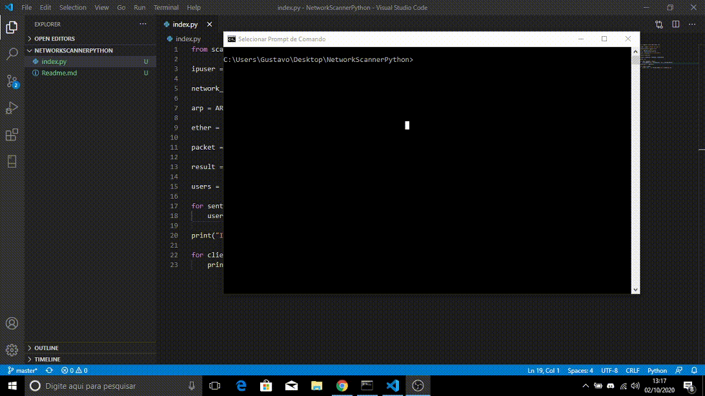

# HISOKA NETWORK SCANNER

Neste repositório, trago o código fonte de um scanner de redes que retorna os endereços de ips e MACs usados na rede.
O objetivo deste repositório é ajudar a comunidade a se desenvolver , além de manter afiada minhas habilidades desenvolvendo usando a linguagem Python.

## Versões

**02/10/2020**

- [x] Pega o endereço de ip e analisa toda a rede trazendo MAC e IPs usados.

## Ideias para possiveis atualizacoes 

- [ ] Armazenar os dados de cada scan organizadamente dentro da pasta logs, em arquivos de texto.
- [ ] Armazenar os dados de cada scan em um banco de dados.

## Como usar

- Clone o repositório
- Use o comando $pip install
- Qualquer erro abra uma questão aqui no repositório

## Documentacao e explicacao da versao atual:
[Artigo Linkedin](#)